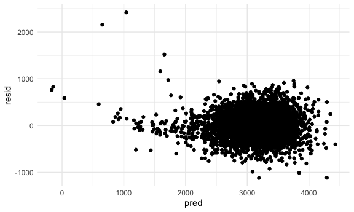

P8105 HW6
================
Jennifer Lee (UNI: jl2361)
2022-11-29

# Problem 1

For this problem, we’ll use the 2017 Central Park weather data that
we’ve seen elsewhere. The code chunk below (adapted from the course
website) will download these data.

weather_df = rnoaa::meteo_pull_monitors( c(“USW00094728”), var =
c(“PRCP”, “TMIN”, “TMAX”), date_min = “2017-01-01”, date_max =
“2017-12-31”) %\>% mutate( name = recode(id, USW00094728 =
“CentralPark_NY”), tmin = tmin / 10, tmax = tmax / 10) %\>% select(name,
id, everything()) The boostrap is helpful when you’d like to perform
inference for a parameter / value / summary that doesn’t have an
easy-to-write-down distribution in the usual repeated sampling
framework. We’ll focus on a simple linear regression with tmax as the
response and tmin as the predictor, and are interested in the
distribution of two quantities estimated from these data:

r̂ 2 log(β̂ 0∗β̂ 1) Use 5000 bootstrap samples and, for each bootstrap
sample, produce estimates of these two quantities. Plot the distribution
of your estimates, and describe these in words. Using the 5000 bootstrap
estimates, identify the 2.5% and 97.5% quantiles to provide a 95%
confidence interval for r̂ 2 and log(β̂ 0∗β̂ 1). Note: broom::glance() is
helpful for extracting r̂ 2 from a fitted regression, and broom::tidy()
(with some additional wrangling) should help in computing log(β̂ 0∗β̂ 1).

# Problem 2

The Washington Post has gathered data on homicides in 50 large U.S.
cities and made the data available through a GitHub repository.

Create a city_state variable (e.g. “Baltimore, MD”), and a binary
variable indicating whether the homicide is solved. Omit cities Dallas,
TX; Phoenix, AZ; and Kansas City, MO – these don’t report victim race.
Also omit Tulsa, AL – this is a data entry mistake. For this problem,
limit your analysis those for whom victim_race is white or black. Be
sure that victim_age is numeric.

``` r
homicide_df = 
  read_csv("data/homicide.csv") %>%
  janitor::clean_names() %>%
  mutate(
    state = toupper(state),
    city_state = str_c(city, state, sep = ", "),
    resolved = as.numeric(disposition == "Closed by arrest"),
    victim_age = as.numeric(victim_age),
    victim_race = fct_relevel(victim_race, "White")
    ) %>%
  filter(!city_state %in% c("Dallas, TX", "Phoenix, AZ", "Kansas City, MO", "Tulsa, AL"),
         victim_race %in% c("White", "Black"))
```

    ## Rows: 52179 Columns: 12
    ## ── Column specification ────────────────────────────────────────────────────────
    ## Delimiter: ","
    ## chr (9): uid, victim_last, victim_first, victim_race, victim_age, victim_sex...
    ## dbl (3): reported_date, lat, lon
    ## 
    ## ℹ Use `spec()` to retrieve the full column specification for this data.
    ## ℹ Specify the column types or set `show_col_types = FALSE` to quiet this message.

For the city of Baltimore, MD, use the glm function to fit a logistic
regression with resolved vs unresolved as the outcome and victim age,
sex and race as predictors. Save the output of glm as an R object; apply
the broom::tidy to this object; and obtain the estimate and confidence
interval of the adjusted odds ratio for solving homicides comparing male
victims to female victims keeping all other variables fixed.

``` r
baltimore_df = 
  homicide_df %>% 
  filter(city == "Baltimore")

baltimore_model =  
  glm(resolved ~ victim_age + victim_race + victim_sex, data = baltimore_df, family = binomial()) 

baltimore_results = 
  baltimore_model %>%
  broom::tidy(conf.int = TRUE) %>%
  filter(term == "victim_sexMale") %>%
  mutate(OR = exp(estimate), 
         OR_conf_low = exp(conf.low),
         OR_conf_high = exp(conf.high)) %>%
  select(term, log_OR = estimate, OR, OR_conf_low, OR_conf_high) %>% 
  knitr::kable(digits = 3)

baltimore_results
```

| term           | log_OR |    OR | OR_conf_low | OR_conf_high |
|:---------------|-------:|------:|------------:|-------------:|
| victim_sexMale | -0.854 | 0.426 |       0.324 |        0.558 |

Now run glm for each of the cities in your dataset, and extract the
adjusted odds ratio (and CI) for solving homicides comparing male
victims to female victims. Do this within a “tidy” pipeline, making use
of purrr::map, list columns, and unnest as necessary to create a
dataframe with estimated ORs and CIs for each city.

``` r
city_homicide_results = 
  homicide_df %>%
  nest(df = -city_state) %>%
  mutate(
    models = map(.x = df, ~ glm(resolved ~ victim_age + victim_race + victim_sex, data = .x, family = binomial())), 
    OR = map(models, broom::tidy),
    CI = map(models, broom::confint_tidy)) %>%
  unnest(OR, CI) %>%
  filter(term == "victim_sexMale") %>%
  mutate(OR = exp(estimate), 
        OR_conf_low = exp(conf.low),
        OR_conf_high = exp(conf.high)) %>%
  select(city_state, OR, OR_conf_low, OR_conf_high)

city_homicide_results
```

    ## # A tibble: 47 × 4
    ##    city_state         OR OR_conf_low OR_conf_high
    ##    <chr>           <dbl>       <dbl>        <dbl>
    ##  1 Albuquerque, NM 1.77        0.825        3.76 
    ##  2 Atlanta, GA     1.00        0.680        1.46 
    ##  3 Baltimore, MD   0.426       0.324        0.558
    ##  4 Baton Rouge, LA 0.381       0.204        0.684
    ##  5 Birmingham, AL  0.870       0.571        1.31 
    ##  6 Boston, MA      0.674       0.353        1.28 
    ##  7 Buffalo, NY     0.521       0.288        0.936
    ##  8 Charlotte, NC   0.884       0.551        1.39 
    ##  9 Chicago, IL     0.410       0.336        0.501
    ## 10 Cincinnati, OH  0.400       0.231        0.667
    ## # … with 37 more rows

Create a plot that shows the estimated ORs and CIs for each city.
Organize cities according to estimated OR, and comment on the plot.

``` r
city_homicide_results %>%
  mutate(
    city_state = fct_reorder(city_state, OR, .desc = TRUE)) %>%
  ggplot(
    aes(x = city_state, y = OR)) +
  geom_point() +
  geom_errorbar(aes(ymin = OR_conf_low, ymax = OR_conf_high)) + 
  theme(axis.text.x = element_text(angle = 90, vjust = 0.5, hjust = 1))
```


The odds of solving homicides in male victims compared to female victims
may be significantly lower in a number of cities (mostly cities depicted
on the right side of this plot- for instance, New York, NY, Baton Rouge,
LA, Omaha, NE) keeping all other variables fixed. We can see that many
of the CIs for these cities do not cross 1 (although not universally),
suggestive of their significance. It is worth noting that in the cities
that appear to have estimated ORs greater than 1, the CIs all cross 1 so
the observed effect is not significant (e.g. Albuquerque, NM, Stockton,
CA, Fresno, CA, etc.)

# Problem 3

In this problem, you will analyze data gathered to understand the
effects of several variables on a child’s birthweight. This dataset,
available here, consists of roughly 4000 children and includes the
following variables:

-   babysex: baby’s sex (male = 1, female = 2)
-   bhead: baby’s head circumference at birth (centimeters)
-   blength: baby’s length at birth (centimeteres)
-   bwt: baby’s birth weight (grams)
-   delwt: mother’s weight at delivery (pounds)
-   fincome: family monthly income (in hundreds, rounded)
-   frace: father’s race (1 = White, 2 = Black, 3 = Asian, 4 = Puerto
    Rican, 8 = Other, 9 = Unknown)
-   gaweeks: gestational age in weeks
-   malform: presence of malformations that could affect weight (0 =
    absent, 1 = present)
-   menarche: mother’s age at menarche (years)
-   mheigth: mother’s height (inches)
-   momage: mother’s age at delivery (years)
-   mrace: mother’s race (1 = White, 2 = Black, 3 = Asian, 4 = Puerto
    Rican, 8 = Other)
-   parity: number of live births prior to this pregnancy
-   pnumlbw: previous number of low birth weight babies
-   pnumgsa: number of prior small for gestational age babies
-   ppbmi: mother’s pre-pregnancy BMI
-   ppwt: mother’s pre-pregnancy weight (pounds)
-   smoken: average number of cigarettes smoked per day during pregnancy
-   wtgain: mother’s weight gain during pregnancy (pounds)

Load and clean the data for regression analysis (i.e. convert numeric to
factor where appropriate, check for missing data, etc.). We note that
`pnumlbw` and `pnumgsa` do not seem to have complete data entry as the
values are all equal to 0. We make sure `babysex`, `frace`, and `mrace`
are all factor variables and relevel them so the reference categories
are male and White for analysis purposes.

``` r
birthweight_df = 
  read_csv("data/birthweight.csv") %>%
  janitor::clean_names() %>%
  mutate(
    babysex = as.factor(babysex),
    frace = as.factor(frace),
    mrace = as.factor(mrace), 
    babysex = fct_relevel(babysex, "1"),
    frace = fct_relevel(frace, "1"), 
    mrace = fct_relevel(mrace, "1"))
```

    ## Rows: 4342 Columns: 20
    ## ── Column specification ────────────────────────────────────────────────────────
    ## Delimiter: ","
    ## dbl (20): babysex, bhead, blength, bwt, delwt, fincome, frace, gaweeks, malf...
    ## 
    ## ℹ Use `spec()` to retrieve the full column specification for this data.
    ## ℹ Specify the column types or set `show_col_types = FALSE` to quiet this message.

Based on a general literature review, we see that `babysex`, `blength`,
`gaweeks`, and `malform` are all established baby-related factors that
may affect `bwt`. In addition, maternal factors such as `mrace`,
`smoken`, `ppbmi` have been associated with preterm delivery and lower
`bwt`. We therefore incorporate all of these variables into a linear
regression model to evaluate which factors remain significant when
holding all other variables constant.

A plot of model residuals against fitted values can help us assess for
linearity, homoskedasticity, and outliers. We see some issues with our
model. Linearly looks OK, though homoskedasticity appears to be
violated. There are also several outliers. We note these issues for now.

``` r
proposed_model =
  lm(bwt ~ babysex + blength + bhead + gaweeks + malform + mrace + smoken + ppbmi, data = birthweight_df)

birthweight_df %>%
  modelr::add_predictions(proposed_model) %>%
  modelr::add_residuals(proposed_model) %>% 
  ggplot(
    aes(x = pred, y = resid)) + 
      geom_point()
```


Compare your model to two others:

-   One using length at birth and gestational age as predictors (main
    effects only)
-   One using head circumference, length, sex, and all interactions
    (including the three-way interaction) between these

Make this comparison in terms of the cross-validated prediction error;
use crossv_mc and functions in purrr as appropriate.

``` r
cv_df =
  crossv_mc(birthweight_df, 100) %>% 
  mutate(
    train = map(train, as_tibble),
    test = map(test, as_tibble))

cv_df = 
  cv_df %>% 
  mutate(
    proposed_model = 
      map(train, ~lm(bwt ~ babysex + blength + bhead + gaweeks + malform + mrace + smoken + ppbmi, data = .x)),
    altmodel1 = 
      map(train, ~lm(bwt ~ blength + gaweeks, data = .x)),
    altmodel2  = 
      map(train, ~lm(bwt ~ bhead + blength + babysex + bhead*blength + bhead*babysex + blength*babysex + bhead*blength*babysex, data = .x))) %>% 
  mutate(
    rmse_proposed = map2_dbl(proposed_model, test, ~rmse(model = .x, data = .y)),
    rmse_alt1   = map2_dbl(altmodel1, test, ~rmse(model = .x, data = .y)),
    rmse_alt2 = map2_dbl(altmodel2, test, ~rmse(model = .x, data = .y)))

cv_df %>% 
  select(starts_with("rmse")) %>% 
  pivot_longer(
    everything(),
    names_to = "model", 
    values_to = "rmse",
    names_prefix = "rmse_") %>% 
  mutate(model = fct_infreq(model)) %>% 
  ggplot(aes(x = model, y = rmse)) + geom_violin()
```



Based on these results and the prediction error distribution, it looks
like the proposed model may be the best given that the rmse is the
lowest. As mentioned in lecture though, which candidate model is best,
though, depends on the need to balance complexity with goodness of fit
and interpretability, which we have not fully explored in this
assignment.
